<!DOCTYPE html>
<html lang="en"><head>
<meta http-equiv="content-type" content="text/html; charset=UTF-8">
    <meta charset="UTF-8">
    <meta name="viewport" content="width=device-width, initial-scale=1.0">
    <title>Semantic industrial categorisation based on Search
        Engine Index</title>
</head>
<body>
    <h4>Semantic industrial categorisation based on Search
        Engine Index</h4>
        

        
Xiao MA1, Jay BAL2
            International Digital Lab, Warwick Manufacturing Group, University of Warwick, Coventry, West
            Midlands, United Kingdom
            2
            International Digital Lab, Warwick Manufacturing Group, University of Warwick, Coventry, West
            Midlands, United Kingdom

            

            <table rules="rows" borde="0" cellspacing="0" cellpadding="0" width="100%" height="100%">
               <tbody><tr>
                   <th>
                       </th><td width="50%" height="50%">

<h5>Abstract</h5> Analysis of specialist language is one of the most pressing
                        problems when trying to build intelligent content analysis
                        system. Identifying the scope of the language used and then
                        understanding the relationships between the language entities
                        is a key problem. A semantic relationship analysis of the
                        search engine index was devised and evaluated. Using search
                        engine index provides us with access to the widest database of
                        knowledge in any particular field (if not now, then surely in
                        the future). Social network analysis of keywords collection
                        seems to generate a viable list of the specialist terms and
                        relationships among them. This approach has been tested in
                        the engineering and medical sectors.

 
                        

<h5>keywords: </h5>Keywords: Intelligent Content, Social Network Analysis,
                            Semantics Web, Categorisation, Word Clustering

 
                            

<h1>1. Introduction</h1> 
                                Analysis and translation of specialist language is necessary
                                when we are to build systems for multidisciplinary working
                                or ones that allow non specialist to access them. For example
                                in healthcare, Systematised Nomenclature of Medicine
                                Clinical Terms (SNOMED CT)) has been jointly developed
                                by the National Health System (NHS) and the College of
                                American Pathologists (CAP). It is designed to standardise
                                clinical language for use across health information systems to
                                solve the problem of poor communication between healthcare
                                practitioners and patients, which causes avoidable deaths and
                                injuries each year [1]. This is a “systematically organized
                                computer processable collection of medical terminology” [1].

                                
Similar communication issues also exist elsewhere, in
                                    Electronic trade for instance. Electronic Data Interchange
                                    (EDI) standards developed many variants for different
                                    sectors, a similar effect is occurring with XML standards. Our
                                    experience with the West Midlands Collaborative Commerce
                                    Marketplace (WMCCM) has revealed similar problems.
                                    WMCCM automatically matches tender opportunities with
                                    company competency to provide focussed opportunities. It
                                    also uses the competencies to identify partnership
                                    opportunities. WMCCM achieves this by categorising tender

                        </td>
                            
                            <td width="50%" height="50%">
                            
and company information against an ontology of engineering
                            sectors and activities. Poor matching results in wasted tender
                            effort and poor partnerships.

                            
The creation or identification of a good ontology for any
                                sector or field is thus important in aiding communication,
                                enhancing collaboration and automating processes. Usually
                                the task of creating the ontology is a mixture of top down
                                derivation and bottom up synthesis, like both WMCCM and
                                SNOMED CT, they collect first hand data from professionals
                                – company bosses or healthcare organisations (IHTSDO
                                members), to unify the terms derived from standards (sourced
                                from books or government classifications). This approach is
                                limited by the need to collect data and evaluate information,
                                some of which may be up to date, some often out of date. A
                                new method to derive ontology for any sector or specialism
                                was investigated: it was based on using the Internet archives
                                (Search Engine Index) as the data source, which may be the
                                largest and most up to date archive of information in most
                                subject areas which are generally available.

                                

<h2>2. Objectives</h2>
                                    The objective of the research was to be able to generate a
                                    subject specific ontology quickly and reliably. This can be
                                    used in an IT system to categorise data and aid efficient
                                    processing of general language enquiries.

                                    

<h2>3. Methodology</h2>
                                        To find keywords around a subject area and map them into an
                                        ontology structure, the following activities were required:

                                        

<h2>3.1 Data source</h2>
                                            Firstly, we need to determine where keywords could be
                                            collected. There are basically three main data sources that
                                            could be used to find the keywords:
                                            <ul>
                                                <li>
                                                    
1. First hand data from an expert(s)

                                                </li>
                                                <li>
                                                    
2. Existing data source which has been professionally
                                                    reviewed
                                                    

                                                </li>
                                                    <li>
                                                        

                                                            (a). Thesaurus
                                                        

                                                    </li>
                                                    <li>
                                                        

                                                            (b). Wordnet (c). Industry codes
                                                        

                                                    </li>
                                            </ul>
                                            

                        </td>

                   
               </tr>
            </tbody></table>
    

    

        <table rules="rows" borde="0" cellspacing="0" cellpadding="0" width="100%" height="100%">
            <tbody><tr>
                <th>
                    </th><td width="50%" height="50%">
                        
3. Extract data from non-specific focused source which
                            contains more random user generated content, such as
                            Internet Archive / Search Engine Index

                            
In this work, the researchers chose to mine word relationship
                                data from the internet. Increasingly the Internet is becoming
                                the ultimate source of information in new or rapidly changing
                                fields, and with its current rate of growth it will become the
                                ultimate resource in most subject areas. There are weaknesses
                                since the content is often not verified sufficiently and may
                                well just disappear at a later date.

                                <h2>3.2 Categorisation</h2>
                                
Secondly, a method to group keywords in an area from the
                                    source is required. There are 3 main / popular methods
                                    available to get grouped keywords:

                                    <ul>
                                        <li>Categorisation: concentrates on “concept formation
                                            and coverage” and allow overlapping [2]</li>
                                            <li>Classification: requires
                                                overlapping” [2]
                                                “only
                                                one
                                                and
                                                no</li>
                                        <li>Taxonomy: emphasizes “delimiting and distinguish”
                                            [3]</li>                                                                                            
                                    </ul>
                    
Uniqueness, no tolerance of overlapping, and delimitation will
                        leave gaps among words, however this research aims to create
                        the keywords set to cover a particular concept. It seems like
                        categorisation is superior to serve the research purpose than
                        other methods.

                    <h2>3.3 Word clustering</h2>
                    
Comparing with other categorisation methods’ characteristics
                        demonstrated in table 1, word clustering which processes sets
                        of words into categories could well serve the research
                        purpose:

                        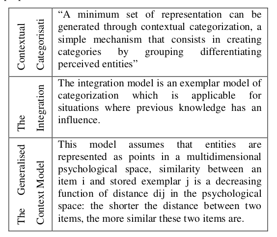
                    </td>
                <td width="50%" height="50%">
                    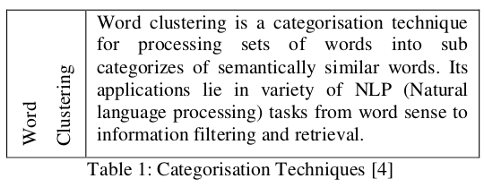
                    
The nature of the research focuses on how “good” categories
                        could be but not how “small”, in other word, it focuses on
                        more quality than quantity. A minimum set could accelerate
                        categorisation process by dealing with a small number of
                        cases, but it will omit some equivalent expression and
                        thesaurus. Therefore, contextual categorisation was not
                        chosen for the research. The integration model highlights the
                        influence of previous knowledge; and as an exemplar-based
                        model, the generalised contextual model is not independent
                        enough from the exemplars, which means the accuracy of the
                        exemplars heavily affects the representation of the output.
                        “Previous knowledge” and “exemplar” are actually the ‘side
                        affect’ of the research and supposed to be minimised, so the
                        integration model and the generalised contextual model are
                        not ideal for the research as well.

                        
Therefore, word clustering shows its advantages:

                        <ul>
                            <li>Applied areas of word clustering fit into the research
                                area very well</li>
                                <li>Additionally web word clustering tools can be
                                    developed to explorer semantically similar words
                                    based on search engine index</li>
                                    <li>The method itself literally describes the experiments
                                        the research will carry out</li>
                        </ul>
                <h2>3.4 Semantic relatedness</h2>
                
In the literature, two main different types of similarity have
                    been used in word clustering which can be differentiated as
                    follows: Semantic similarity which means two words that are
                    paradigmatically similar (thesaurus), they are substitutable in
                    a particular context. For example, in the context I ate the
                    breakfast, the word breakfast can be substitute by meal with
                    little change to the meaning and structure of the sentence, and
                    therefore these two words can be identified to be semantically
                    similar; (2) Semantic relatedness means two words that are
                    significantly occurring simultaneously in text. For instance,
                    fire and burn are semantically related since they often appear
                    together within the same context [5].

                
In this research, we focus more on semantic relatedness than
                    semantic similarity, because those keywords which could
                    represent a concept are not necessarily substitutable with each
                    other but are more likely to be co-occurring in sentences.
                    Moreover, keywords normally used by public to describe a
                    particular field may not be the same as the words used by
                    expertises’ professional terms, and it is more interesting to
                    investigate the pattern of normal publics’ input. Also, there
                    are not professionally defined categories in some of emerging
                    field, for example Medical Tourism, it would be valuable if
            
                </td>  
                
            </tr>
        </tbody></table>
    

    

        <table rules="rows" borde="0" cellspacing="0" cellpadding="0" width="100%" height="100%">
            <tbody><tr>
                <th>
                    </th><td width="50%" height="50%">
                        
the research can generate widely recognised and applied
                            categories by general public for such areas.

                            <h2>3.5 Keywords mapping
                                apping &amp; Social Network
                                Analysis</h2>
                                
Investigating the relationship among selected keywords would
                                    help map them into ontology structure.

                                    
Figure 1 demonstrated how social network analysis defines
                                        “my” social structure in a social group by related contacts.
                                        The same analysis could be applied to examine the “contacts”
                                        of selected keywords based on their “social” relationship – in
                                        this case words that semantically related nearer or further
                                        away. Further analysis could also expose the “leading
                                        contacts” (representative
                                        ive keywords) of a certain group and
                                        their relationship to the others.

                    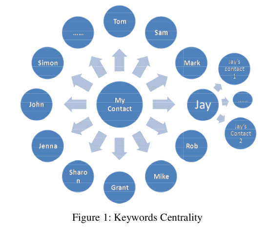
                    <h2>4. Technology &amp; Development</h2>
                    
According to the methodology, this research can be
                        generalised into 2 stages:

                        <ul>
                            <li>Keywords collection (find the keywords from the
                                source)</li>
                                <li>Keywords mapping (organise the keyword
                                    collection)</li>
                        </ul>                                            
                    </td>
                    <td width="50%" height="50%">
                        <h2>4.1 Keywords “naming machine”</h2>
                        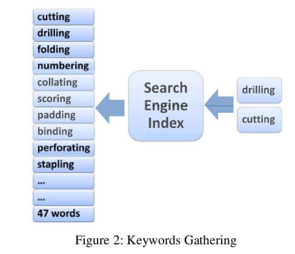
                        
Social network analysis provides a “finding” method called
                            “naming machine” to find people who may be in the same
                            social group with A by askin
                            asking for A’s contact list (co-
                            occurring with A) [6].. Similarly, the online word clustering
                            tool utilised brings back a word’s co
                            co-occurring words from
                            search engine index based on the given keyword. This was
                            applied as our “naming machine” to generate “contacts”
                            “contact
                            (semantic related keywords) around our given words.
                            Experiments have shown that 2 inputs to the naming machine
                            generate much better results than any other options. The
                            number of initial keywords helps define the search space
                            spac for
                            keyword semantic matching:
                            g: the
                            t more keywords used, the
                            tighter the search space. Figure 2 showed an example of the
                            “naming process” on two selected keywords.

                            
In the experiment, k1 , k2 , k3 , k4 , k5 , k6 are predefined 3 pairs of
                                keywords which are already known as keywords in a certain
                                c
                                category means M (M is the concept/definition of the
                                category). Due to the randomness 1 pair of keywords will get,
                                2 pairs of keywords are required. But with 3 pairs, the system
                                will tolerant some fault inputs (will be proved and discussed
                                below), which
                                hich would make the output more accurate.

                                
Function f GS is the process to capture semantic predicts by
                                    using given keywords. Set S represent the collection of the
                                    predicted keywords which function f GS have got.

                                    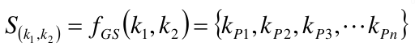
                                    
Then, in order to generate more optimised outputs, we firstly
                                        paired up each given keyword with each word from its own
                                        predict set to generate extended collections.
                                        Extended collection for k1 and k2:

                    </td>
                
            </tr>
        </tbody></table>
    

    

        <table rules="rows" borde="0" cellspacing="0" cellpadding="0" width="100%" height="100%">
            <tbody><tr>
                <th>
                    </th><td width="50%" height="50%">
                        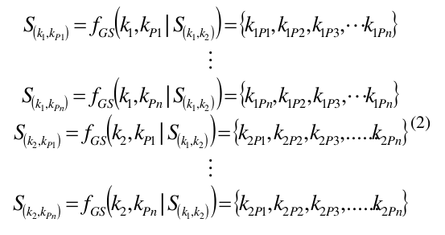
                        
Same process has been undertaken
                            taken against k3 , k4 , k5 , k6 . Then,
                            a complete pairing up of any 2 predicts from any predict set
                            generated the final keyword prediction.

                            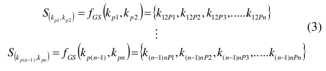
                            
In the formula above:

                            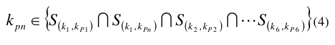
                            
Such process formed the naming machine
                                ine for the research. By
                                applying the naming machine on initial words in a subject
                                area and their “contacts”, the technique bring back a much
                                wider keywords corpus to cover the chosen subject (figure 3).
                                Such large keywords collection may be able to cover most of
                                the words commonly used and thus reduce semantic gaps.

                                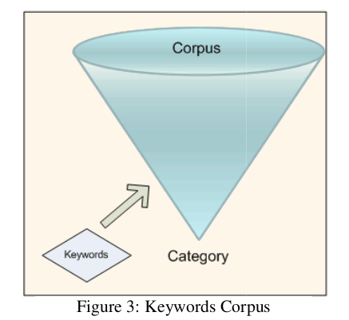
                    <h2>4.2 Keywords centrality analysis</h2>
                    
After analysing the semantically
                        emantically generated linkages of a
                        certain word group, those members who have “appeared”
                        more times than others could be regarded as more
                        representative of the group, or more “centrally” located.
                        The appearance of those predicts generated above would be
                        generalised as:
                        A(a, S ) defines whether output a exists in a extended set
                        S . Aggregation of A represents the total appearance of a

                                    
                    </td>
                    <td width="50%" height="50%">
                        
output keywords, which indicates
                            probability with the given keywords.

                            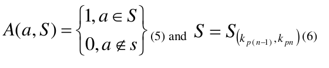
                            
Hence any keyword
                                P(a ) as:

                            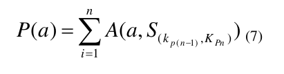
                            
Centrality analysis of the keywords collection
                                colle
                                maps the
                                keywords on a curve as shown in Figure 4 according to the
                                number of appearances ( P (a
                                a) as Y-Axis) of those keywords
                                produced by the naming machine ( a as X-Axis):

                                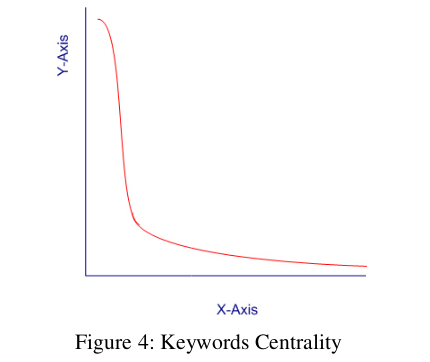
                                
In order to understand the data better, cut
                                    cut-off points have been
                                    chosen (cut point with y=-x)
                                    x) to cut the raw distribution into 3
                                    sections as illustrated
                                    rated in figure 5.

                    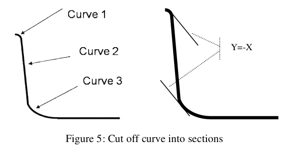
                    
Curve 1 (definition zone) presents a slow decreasing trend of
                        co-occurrence
                        occurrence which presents those core keywords that mostly
                        used to define the concept. Curve 2 (description zone) shows a
                        fast drop that indicates those keywords that are used quite
                        often in description of the topic. Curve 3 (connection zone)
                        includes those keywords mentioned around the concept, but
                        not necessarily a part of the concept, although they do have
                
                    </td>
                
            </tr>
        </tbody></table>
    

    

        <table rules="rows" borde="0" cellspacing="0" cellpadding="0" width="100%" height="100%">
            <tbody><tr>
                <th>
                    </th><td width="50%" height="50%">
                        
certain connection with some of the words in definition or
                            description zone (the Google long tail?).

                            <h2>5. Conclusions and Implementation</h2>
                            
The research started by applying this approach to the
                                engineering sector because there was existing good quality
                                data to evaluate the output generated. The experiment against
                                engineering sector started with 3 pairs of keywords (in order
                                to provide some tolerance to initial world selection) brought
                                back a large prediction set containing 11,000 keywords from
                                6206 unique keywords pairs.

                    <h2>5.1 Results accreditation</h2>
                    
Having grouped the keywords in 3 zone, comparisons
                        between the research output and industrial categorisation (UK
                        SIC code and WMCCM) showed positive correlation.

                        
Definition zone members share a very distinguishable
                            appearance rate, and they cover most of the WMCCM
                            categories and UK SIC codes in the area. Experiment on
                            “machining” confirmed that the definition zone covers more
                            than 70% of the UK SIC machining examples (National
                            Statistics, 2001) and a few other SIC keywords exist in the
                            description zone; all the WMCCM categories exist in the
                            prediction. Moreover, the prediction covers even more areas
                            than both SIC and WMCCM, for instance, prediction covers a
                            number of keywords in manufacturing subject area. Such
                            prediction provides evidence that the results are not only
                            accurate enough, but also have a wider coverage than the
                            other references.

                            
So the results generated provide a good mapping of the
                                subject
                                area
                                and
                                they
                                incorporate
                                the
                                latest
                                discussions/information in the subject areas. Further research
                                would consider ways of measuring the strength of the
                                relationship between different words to produce a whole
                                “social network” of the subject area.

                                <h2>5.2 Fault tolerance</h2>
                                
Three pairs of source keywords were designed to avoid
                                    potentially misleading: repeated experiments showed that at
                                    least one pair of keywords in the definition zone and another
                                    one in the description zone would be enough to reach the
                                    same result as all three pairs in definition zone. Therefore, the
                                    research could tolerate errors in 1/3 of the source keywords
                                    and still maintain the resultant quality level.
 
                                               
                    </td>
                    <td width="50%" height="50%">
                         <h2>5.3 Implementation</h2>
                         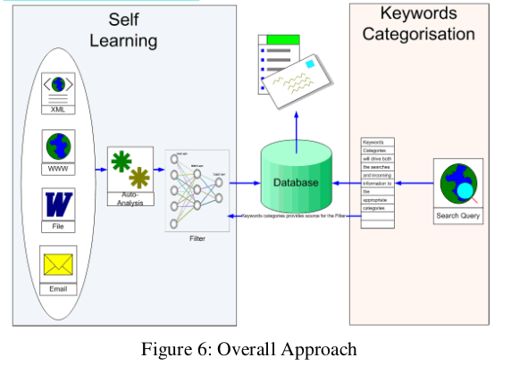
                         
Figure 6 illustrates the basic architecture for a system that can
                            analyse and categorise the language in a particular specialism.
                            Various enquiry sources act as the input of the system, and an
                            auto-analysis system will pick up useful words from the text.
                            Then the keyword corpus derived by the semantic analysis
                            acts as the filtering function which would direct input
                            enquiries into different categorisations or tag them with
                            different categories. Such a system could provide a natural
                            language front end for automating enquiries for specialist
                            help.

                            
Such system in engineering will be applied to the WMCCM to
                                improve its “tender to company capability” matching; and
                                further research on medical terminology is expected to help
                                automate customer enquiry categorisation and assistance for
                                service providers such as The Taj Medical Group, one of the
                                UK’s leading medical tourism facilitator and a research
                                partner for this project.

                                <h2>6. Reference</h2>
                                
[1] IHTSDO. SNOMED CT. [Online] Available at:
                                    http://www.ihtsdo.org/snomed-ct/ [Accessed 25 Feb 2009]

                                
[2] Jacob, K. Classification and Categorization: a Difference
                                    That Makes a Difference. [Online] Available at:
                                    http://findarticles.com/p/articles/mi_m1387/is_3_52/ai_n6080
                                    402/pg_3 [Accessed 21 Feb 2007]

                                
[3] Mayr, E., 1982. The growth of biological thought,
                                    Diversity, evolution, and inheritance. Cambridge, MA:
                                    Harvard University Press.,

                                
4] Ulrike, H. &amp; Ramscar, M., 2001. Similarity and
                                    Categorization”. New York: Oxford University Press.

                                
5] Istituto Di Linguistica Computazionale. Word Clustering.
                                    [Online]
                                    Available
                                    at:
                                    http://www.ilc.cnr.it/EAGLES96/rep2/node37.html [Accessed
                                    12 Apr 2007]

                                
[6] Carrington, P. Scott, J. &amp; Wasserman, S., 2005. Models
                                    and methods in social network analysis. New York:
                                    Cambridge University Press.

                                
[7] National Statistics. Standard Industrial Classification
                                    (SIC).
                                    [Online]
                                    Available
                                    at:
                                    http://www.statistics.gov.uk/methods_quality/sic/contents.asp
                                    [Accessed 4 June 2007]

                    </td>
                
            </tr>
        </tbody></table>
    

</body></html>